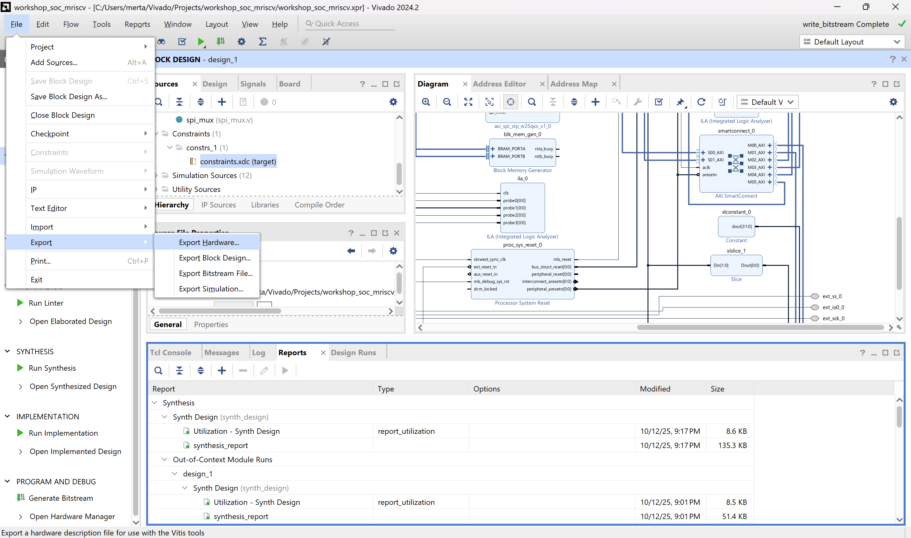

# Workshop SoC MRISCV
Oleh Nur Cahyo Ihsan Prastyawan\
Rabu, 15 Oktober 2025
## 1. Pendahuluan
Workshop ini diadakan untuk menguji model yang telah dibuat sejauh ini. Fokus utama dari workshop ini adalah menguji core MRISCV yang dibuat oleh Universidad Industrial de Santander (UIS) untuk dijadikan core pada SoC tipe mikrokontroler yang ingin dibuat. Panduan ini berisi langkah - langkah untuk mereplikasi sistem yang telah dilakukan sebelumnya.
## 2. Alat dan Bahan
### Software
1. Xilinx Vivado
2. Xilinx Vitis IDE
3. Serial Viewer (PuTTY, Arduino Serial Monitor, RealTerm)
### Hardware
1. Board FPGA
2. USB UART
3. Winbond W25Q128
## 3. Langkah - langkah
### Membuat Project Baru
1. Buka aplikasi Xilinx Vivado
    
    > Versi Xilinx Vivado yang digunakan adalah 2024.2
    
2. Klik Create New Project..., lalu klik Next
   
   > Digunakan untuk membuat project baru

3. Beri nama dan lokasi project, lalu klik Next
    
    > Nama yang digunakan adalah workshop_soc_mriscv dengan lokasi project berada pada Vivado/Projects/

4. Pilih tipe project seperti pada gambar, lalu klik Next
      

5. Pilih Parts/Boards yang dipakai, lalu klik Next
    
    > Boards/Part yang digunakan adalah Antminer S9 Board yang menggunakan chip Xilinx XC7Z010

6. Klik Finish
    

7. Tampilan Project Manager 
    

8. Pada tab sources, klik kanan pada Design Sources lalu pilih Add Sources
    

9. Pilih add or create design sources
    

10. Pilih add directories
    

11. Pilih lokasi pada folder workshop_mriscv/rtl, lalu klik Select
    

12. Klik Finish
    

13. Pada tab IP Integrator, klik Create Block Design
    

14. Beri nama pada block design yang ingin dibuat, lalu pilih OK
    

15. Tampilan Block Design akan muncul lalu klik Add IP 
    

16. Ketik Microblaze V pada nama pencarian lalu Klik Microblaze V
    

17. Klik Run Block Automation
    

18. Atur opsi seperti pada gambar, lalu klik OK
    

19. Berikut tampilan Block Microblaze V
    

### Menambahkan IP dari Vivado

20. Tambahkan IP beserta options-nya sebagai berikut:
- 1 AXI Smartconnect
    
- 1 AXI BRAM Controller
    
- 1 Block Memory Generator
    
- 2 AXI GPIO
  - GPIO0
  
  - GPIO1
  
- 1 AXI Uartlite
  
- 1 AXI Quad SPI
    
- 2 ILA
    - ILA0
    
    - ILA1
    
- 2 Slice
  - Slice0
  
  - Slice1 
  
- 1 Constant
    
- 1 Processor System Reset
    

21. Hasil Board Design setelah ditambahkan seluruh IP
    

### Menambahkan module
22. Klik kanan pada tampilan board design, lalu klik Add Module
    

23. Cari module mriscvcore, lalu klik OK
    

24. Ulangi langkah menambahkan module untuk modul berikut:
    - spi_mux
    > Module Multiplexer SPI (mux untuk AXI Quad SPI dan AXI_SPI_XIP_W25QXX)
    - axi_spi_xip_w25qxx
    > Module AXI SPI dengan mode XIP untuk menjalankan program pada winbond flash memory

25. Hasil Board Design setelah ditambahkan module
    

### Menyambungkan antar modul
26. Pada modul Microblaze V, klik kiri dan tahan pada port M_AXI_DP lalu geser hingga menuju modul AXI Smartconnect. Lalu sambungkan ke port S00_AXI
    
27. Ulangi langkah yang sama sehingga wiring sama dengan [file berikut](documentation/pdfs/wiring_bd.pdf)

### Mengatur Port External
28. Klik kanan pada port UART dari AXI Uartlite
    

29. Makan tampilan AXI Uartlite menjadi seperti pada gambar
    

30. Ulangi Hal tersebut pada Port yang ditunjukkan pada tabel
    
|  Module |   Port   |
|:-------:|:--------:|
|         |  ext_sck |
|         |  ext_ss  |
| SPI Mux | ext_mosi |
|         | ext_miso |
|  GPIO0  |   GPIO   |

31.  Hasil dari port external ditunjukkan pada gambar

### Menambahkan clock
#### Untuk FPGA dengan Zynq7 Processing System
28. Tambahkan IP Zynq7 Processing System
    
29. Klik pada Run Block Automation, lalu atur opsi seperti pada gambar
    
30. Klik dua kali pada module Zynq7, lalu pada PS-PL Configuration hapus
    centang pada GP Master AXI Interface->M_AXI_GP0 Interface
    
31. Pada tab Clock Configurations, ubah konfigurasi seperti pada gambar, lalu klik OK
    
32. Tampilan Zynq7 Processing System
    
33. Hubungkan port yang akan dijelaskan pada tabel berikut

| Zynq7 PS |  Port Module  | Module |
|:-----:|:--------:|:------:|
| FCLK_CLK0   | Microblaze V | Clk |
| FCLK_CLK1   |  ILA0 dan ILA1 |   clk |
| FCLK_RESET0_N  | Processor System Reset | ext_reset_in |

34. Hasil block design tampak seperti pada gambar
    

#### Untuk FPGA tanpa Zynq7 Processing System
28. Tambahkan IP Clocking Wizard
    
29. Klik dua kali lalu pada Clocking Options, ganti options seperti pada Gambar
    
30. Hubungkan port yang akan dijelaskan pada tabel berikut
 
| Clocking Wizard |  Port Module  | Module |
|:-----:|:--------:|:------:|
| clk_out1   | Microblaze V | Clk |
| clk_out2   |  ILA0 dan ILA1 |   clk |

31. Hasil block design dengan IP Clocking Wizard
    

32. Klik kanan pada port clk_in1 dari Clocking Wizard
    

33. Ulangi juga pada port resetn dari Clocking Wizard sehingga tampilan menjadi seperti pada gambar.
    

### Memberikan alamat untuk setiap module AXI
35. Buka tab address editor
   

36. Klik kanan lalu klik Assign All
   
37. Module AXI yang telah ditetapkan alamatnya ditunjukkan pada gambar
    
38. Ganti semua address dan size-nya sesuai dengan gambar
    

### Reset Pin dan Validate Design
39. Buka tab Block Design, lalu pada module Microblaze RISC-V Local Memory klik tanda '+'. Klik kanan pada pin LMB_Rst/SYS_Rst. Klik Make Connection
    
40. Pilih pin bus_struct_reset
    
    > Hubungkan juga Debug_SYS_Rst pada Microblaze Debug Module (MDM) V dengan mb_debug_sys_rst pada Processor System Reset
42. Pada tab Design, Klik kanan pada design lalu klik Validate Design
    

43. Pastikan pada proses validate design tidak terdapat error atau critical warning
    

### Membuat HDL wrapper dan generate block design
44. Pada tab Sources, klik kanan pada design lalu klik Create HDL Wrapper...
    

45. Pilih opsi seperti pada gambar
    

46. Klik kanan pada HDL wrapper yang telah dibuat, lalu pilih Set as Top
    

47. Klik Generate Block Design
    

48. Klik Generate
    

### Menambahkan constraints
49. Pada Tab Sources, klik kanan pada folder Constraints lalu klik Add Sources...
    
50. Pilih opsi Add or Create Constraints
    
51. Klik Add Files
    
52. File constraints terletak pada direktori constraints.
    
53. Klik Finish
    
54. Klik kanan pada file constraints yang telah ditambahkan, klik Set as Target Constraint File
    

55. Edit Constraints dan sesuaikan dengan port/pin board yang digunakan
    

### Generate Bistream
55. Klik Generate Bitstream
    
56. Klik OK untuk membuat file bitstream
    
57. Tunggu hingga muncul pesan seperti pada gambar, lalu pilih opsi View Reports dan klik OK
    
58. Klik tab File->Export->Export Hardware...
    
59. Klik OK
    
60. Pilih opsi Include Bitstream
    
61. Pilih nama dan lokasi dari hardware yang ingin diekspor
    
62. Klik Finish
    

### Vitis IDE (Membuat Platform Component)
63. Buka Vitis Unified IDE
    

64. Klik Set Workspace...
    

65. Cari lokasi folder project Vivado, lalu buatlah folder dengan nama software. Klik Select Folder
    

66. Klik Create Platform Component
    

67. Beri platform nama platform-riscv
    

68. Klik Browse lalu pilih file .xsa yang sebelumnya telah dibuat menggunakan software Vivado. Lalu klik Next
    

69. Pilih Standalone pada opsi Operating System dan microblaze riscv pada opsi Processor
    

70. Klik Finish
    

### Vitis IDE (Membuat Application Component)
71. Klik tab File->New Component->Application
    

72. Beri nama app_loader_mriscv, lalu klik Next
    

73. Pilih platform-riscv, lalu klik Next
    

74. Pilih standalone_microblaze_riscv, lalu klik Next
    

75. Pilih Add Files
    

76. Pilih semua files yang berada pada folder software
    

78. Klik Finish lalu tunggu hingga selesai
    

### Langkah Tambahan untuk Pengguna FPGA dengan Zynq7 PS
1. Ulangi proses yang sama untuk membuat Platform. Perhatikan gambar Summary yang menunjukkan opsi apa saja yang harus disesuaikan
   
   
2. Ulangi proses yang sama untuk membuat Application. Perhatikan gambar Summary yang menunjukkan opsi apa saja yang harus disesuaikan
   

3. Build dan Run application yang telah dibuat sebelum menjalankan application app_loader_mriscv
   

### Build dan Run Application

79. Klik Build untuk mengkompilasi kode program, lalu tunggu hingga selesai
    

80. Klik Run untuk menjalankan program
    

81. Lihat output LED dan Serial melalui program Serial 

### Hasil
1. Output UART Serial
   
   

### Kompilasi Program.h
#### Software yang dibutuhkan
1. Windows Subsystem Linux
2. xPacks Dev Tools [Guide](https://xpack-dev-tools.github.io/docs/getting-started/)
3. Make

#### Langkah - Langkah
1. Buka folder firmware
   
2. Klik kanan lalu klik Open In Terminal
   
3. Ketik wsl lalu tekan Enter untuk masuk ke dalam environment WSL
   
4. Ketik make all untuk mengkompilasi file program.h
   
5. File program.h otomatis terkompilasi
   